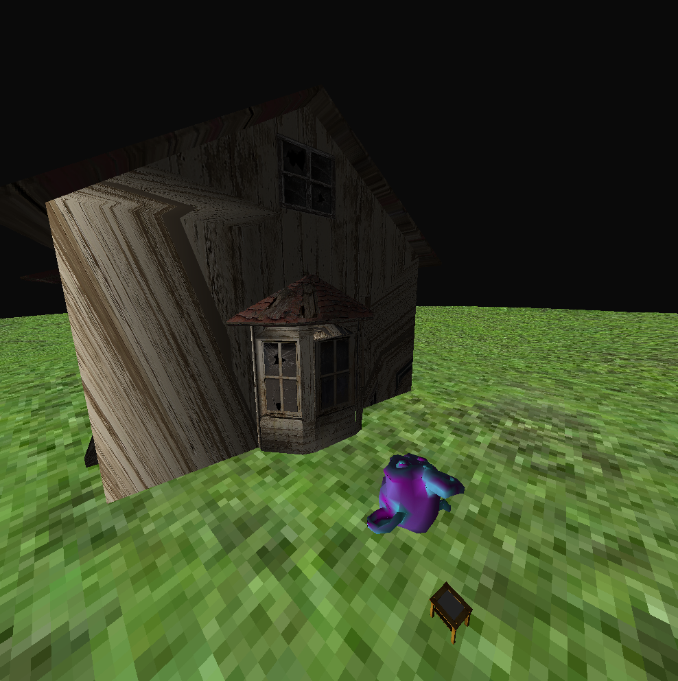
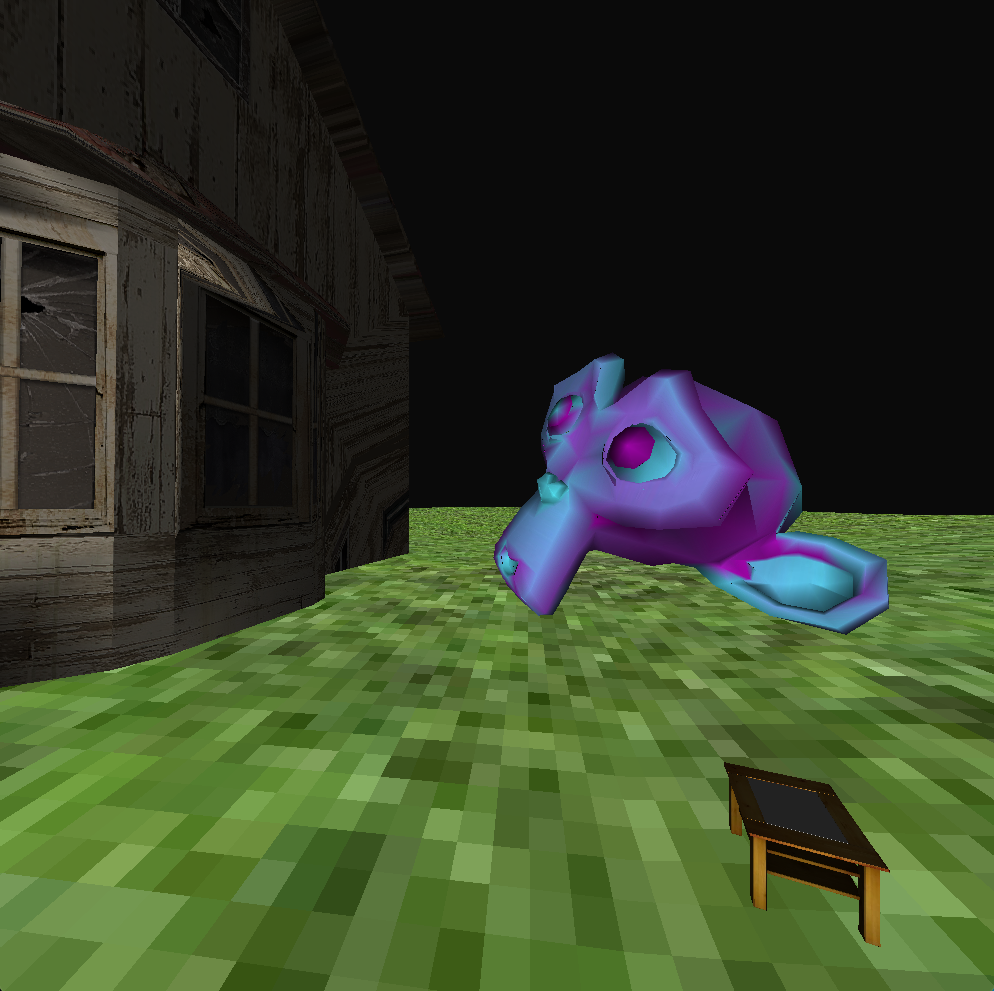
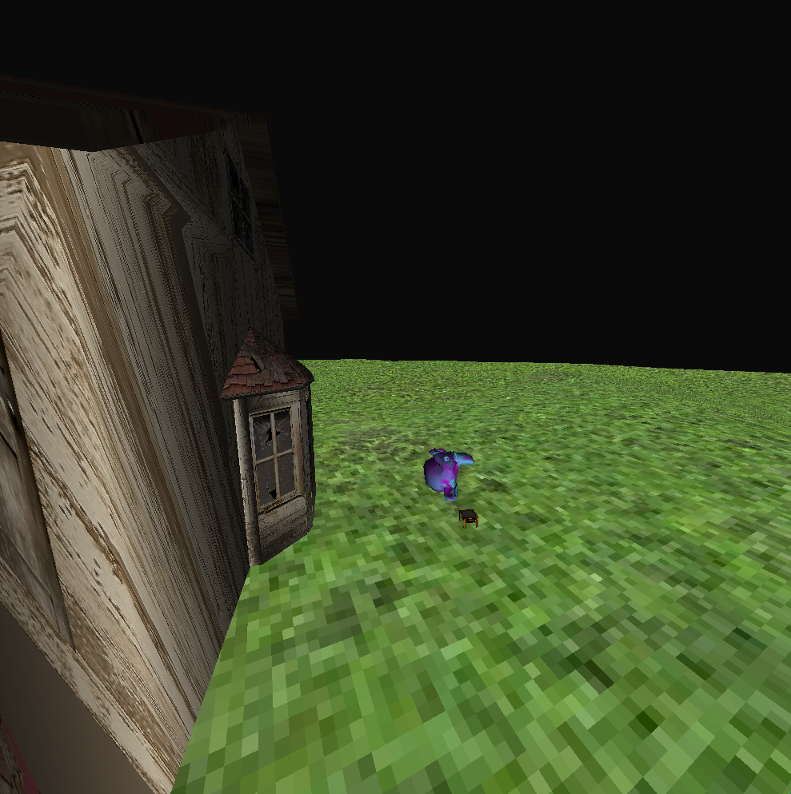

# 3d render from zero
Имплементация основных этапов пайплайна 3D-рендеринга, а также демонстрация в виде приложения с 3D-сценой. Сборка и тестирование проходили под macOS, на линуксе не запускал, но есть предположение, что там бем более должно работать)
Как запустить:
1) Склонировать репозиторий.
2) Прописать из корня:
```bash
mkdir Release && cd Release && cmake -DCMAKE_BUILD_TYPE=Release .. && make 3d_render && ./3d_render
```
ВАЖНО! Предварительно нужно установить библиотеку SFML, это можно сделать, например, командой, если вы собираете на linux:
```bash
sudo apt-get install libsfml-dev
```
Если в процессе установки возникли ошибки или же вы собираете под macOS, то установить библиотеку можно напрямую с [официального сайта](https://www.sfml-dev.org/download.php).

При запуске будет 3-мерное пространство, где можно оценить построение по нескольким моделям. На клавиши WASD можно ходить, а с помощью мыши (или тачпада) поворачивать камеру.
При запуске приложения запустится программа, в которой будет интерактивная 3D-сцена. Скриншоты из приложения:



